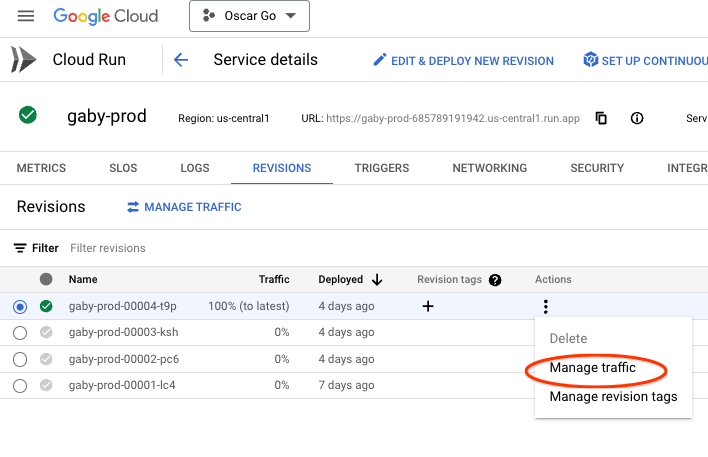

# Oscar GCP

The packages in this module support Oscar running on the Google Cloud Platform (GCP).
It is a separate module to avoid having the main Oscar module, golang.org/x/oscar,
depend on GCP.

## Operations

### Stopping gaby

- With the UI:
  1. Visit https://console.cloud.google.com/cloudscheduler?project=oscar-go-1
  2. Click the checkbox to the left of gaby-prod.
  3. Click “PAUSE” in the list of actions along the top of the page.
     - If the actions are grayed out, you don’t have permission. Everyone on
       oscar-team@google.com should have the Cloud Scheduler Admin role, which should
       permit this.

From the command line:
```
gcloud --project oscar-go-1 scheduler jobs pause gaby-run-prod --location us-central1
```

If that fails with a permission error, make sure you have authenticated with
```
gcloud auth application-default login
```

### Deploying a Cloud Run service

The gaby-prod service is deployed automatically on each push to master of the oscar repo
via a cloud build trigger deploy-gaby-prod-on-push.

The services gaby-devel and gaby-prod can also be deployed manually following
the instructions below.

#### Deploy a service at the latest commit to master

From the UI:
1. Find the appropriate Cloud Build Trigger (`deploy-gaby-devel` or `deploy-gaby-prod`).
2. Click RUN followed by RUN TRIGGER. (Do not edit the environment variables).


Or, from the command line:
```
gcloud builds triggers run [TRIGGER_NAME] --branch master
```
Here, [TRIGGER_NAME] is one of `deploy-gaby-devel` or `deploy-gaby-prod`.

Check that the deploy was successful by monitoring the Cloud Build History. (Deploys take around 8 minutes to complete).

#### Deploy a service at a specific commit

Run:
```
gcloud builds triggers run [TRIGGER_NAME] --sha [COMMIT]
```

where [TRIGGER_NAME] is one of `deploy-gaby-devel` or `deploy-gaby-prod` and [COMMIT] is the full commit hash.

### Rolling back a Cloud Run service

Roll back a service from the UI:

1. Click the service name (gaby-devel or gaby-prod) in [Cloud Run](https://console.cloud.google.com/run?project=oscar-go-1).
2. Click the "REVISIONS" tab.
3. For the revision you want to roll back, click the "Actions" nav bar, then "Manage Traffic":

4. Set the traffic for this revision to 0%, and pick a healthy revision (usually the previous one), to direct 100% of traffic to. Click "SAVE".

Or from the command line:
```
gcloud run services [SERVICE] update-traffic --to-revisions [REVISION]=100
```
Here, [SERVICE] is either `gaby-prod` or `gaby-devel` and revision is the
revision name to roll back to, which can be found in the revision history, e.g.
gaby-prod-00004-t9p).

[Full guide to rollbacks](https://cloud.google.com/run/docs/rollouts-rollbacks-traffic-migration)

## GCP dashboards

[Firestore](https://console.cloud.google.com/firestore/databases?project=oscar-go-1)
[Cloud Run](https://console.cloud.google.com/run?project=oscar-go-1)
[Cloud Build](https://console.cloud.google.com/cloud-build/builds?project=oscar-go-1)

## Secrets and environment variables

```
OSCAR_PROJECT=oscar-go-1
```

The GitHub API token and the Gemini API key are in the GCP Secret Manager, under
hex-encoded names. You shouldn’t need to look at them. Programs that include the
internal/gcp/gcpsecret package will be able to access them.

## Terraform

TODO

## References

[README](go.dev/s/oscar)
[Codebase](golang.org/x/oscar)
